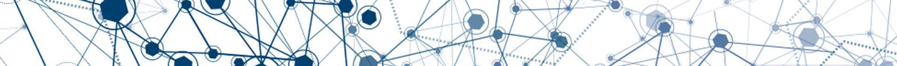

#World-11

Репозиторий домашней работы по нейросетям.

### Что было изучено

1. Рассмотрены общие возможности нейросетей
2.  Познакомились с Google Colaboratory (Colab) 
3.   Советы по оформлению GitHub  
4.   Рассмотрели существующие сервисы с применением нейросетей
5.   Результаты работы некоторых библиотек
